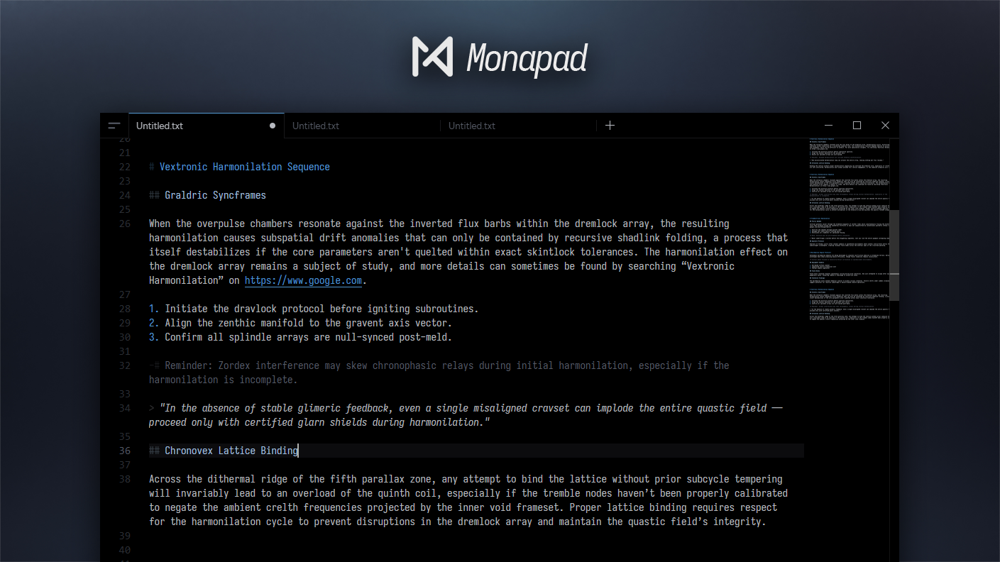

  <a href="https://sheetau.github.io/monapad/">Website</a>
  ·
  <a href="https://github.com/sheetau/monapad/releases">Releases</a>
  ·
  <a href="https://github.com/sheetau/monapad/blob/main/CONTRIBUTING.md">Contributing</a>

<h1></h1>

**The text editor that thinks like a code editor**

Built on Monaco, the editor engine used in VSCode, Monapad brings familiar editing tools to everyday writing. Its text-focused language combines lightweight syntax highlighting and heading-based folding to keep long documents readable without requiring Markdown formatting.

[Download for Windows](https://github.com/sheetau/monapad/releases/latest)

## Features:

- A clean interface with responsive, Chromium-style tabs.
- VSCode-style editing, including search and replace, multi-cursor editing, and familiar keyboard shortcuts.
- Split View for side-by-side or top-and-bottom editing.
- Diff View to compare your working copy with the file on disk.
- Text-focused syntax highlighting and folding:
  - Highlighted headings (`#`, `##`, and `###`), with heading- and indentation-based folding.
  - Subtle subtext for lines starting with `-# `.
  - Highlighted markers for bulleted and numbered lists.
  - Italic quote lines starting with `> `.
  - Inline highlighting with single backticks and lightly highlighted, foldable fenced code blocks.
- A side panel with built-in Notes and global search across all open tabs and notes.
- Markdown syntax highlighting.
- [Custom CSS and Themes](https://github.com/sheetau/monapad/blob/main/CONTRIBUTING.md#how-to-setup-custom-theme), including compatible themes from installed VSCode extensions.
- Share the current note with another device using a temporary local QR code or link.
- Autosave and crash recovery for unsaved edits.
- Optional session restoration for all windows, the last active window, or none, including unsaved tabs and split layouts.
- Optional Japanese word segmentation using Kuromoji.

  
  

  
  

## Downloads:

Download the latest **Monapad-Setup-x.x.x.exe** from [Releases](https://github.com/sheetau/monapad/releases/latest). Read the [Privacy Policy](PRIVACY.md) for information about data handling.

> ⚠️ Since this app is not code-signed yet, Windows SmartScreen may show a warning when launching the installer, especially while the download count is still low.
> If you see the warning, click “More info” and then “Run anyway” to proceed with the installation.
> This is expected behavior and the warning will disappear over time as the app gains reputation.

## Shortcuts:

- Ctrl+T to create new tab.
- Ctrl+Shift+T to reopen recently closed tab.
- Ctrl+W to close current tab.
- Middle-click on a tab to close it.
- Ctrl(+Shift)+Tab to switch between tabs.
- Ctrl+Num(1-9) to quickly switch to specified tab.
- Ctrl+"+/-" or "mouse wheel" for zooming. Ctrl+0 to reset zooming to default.
- Ctrl+Click to open link.
- Ctrl+/ to toggle subtext on current line.
- Ctrl+Shift+Num(1-3) to toggle heading 1-3 on current line.
- Ctrl+F/H to find & replace.
- Ctrl+Shift+F to open global search view.
- Ctrl+G to go to a specific line.
- Ctrl+Shift+O to go to a specific heading.
- Ctrl+P to go to a specific file.
- Ctrl+Shift+P or F1 to open command list.
- Ctrl+B to toggle the side panel.
- Ctrl+Alt+D to toggle Diff View.
- `Ctrl+\` to split the current tab to the right.
- `Ctrl+K`, then `Ctrl+\` to split the current tab above.
- Ctrl+, to open settings.
- F11 to toggle full screen.

For more editor shortcuts, check the command list or refer to the sections **Basic editing**, **Search and replace**, and **Multi-cursor and selection** in [this link](https://code.visualstudio.com/shortcuts/keyboard-shortcuts-windows.pdf).

## Custom Themes:

- [Ayu Theme](https://github.com/sheetau/monapad/tree/main/customthemes/ayu/README.md) [[sheeta](https://github.com/sheetau)]
- [Ink Theme](https://github.com/sheetau/monapad/tree/main/customthemes/ink/README.md) [[sheeta](https://github.com/sheetau)]

To use custom themes, download CSS file from the above list or from [official repository](https://github.com/sheetau/monapad/tree/main/customthemes) and place it to themes folder that can be opened from the settings in the app.

Monapad also detects compatible themes from installed VSCode extensions and lists them under Menu > Themes. Extension folders are detected automatically; additional search locations can be specified by editing `vscode-theme-paths.txt` in Monapad's themes folder and restarting the app.

Click [here](https://github.com/sheetau/monapad/blob/main/CONTRIBUTING.md#how-to-setup-custom-theme) to see how to setup and submit your own custom themes.

## Contributing:

Monapad is open source and we welcome contributions; see the [Contributing Guidelines](https://github.com/sheetau/monapad/blob/main/CONTRIBUTING.md) for custom theme submissions and translations. Report bugs or submit feature requests [here](https://github.com/sheetau/monapad/issues).

- Localization Contributors:
  - [zh-CN][Chinese]: [kazepu](https://github.com/kazepu)
  - [de-DE][German]: [Undertaker-afk](https://github.com/Undertaker-afk)
  - [pt-BR][Brazilian Portuguese]: [akaimxntis](https://github.com/akaimxntis)
  - [it-IT][Italian]: [Dikaios](https://github.com/zDikaios)
  - [es-ES][Spanish]: [Dikaios](https://github.com/zDikaios)

## Dependencies and References

- [Electron Builder](https://github.com/electron-userland/electron-builder)
- [Webpack](https://github.com/webpack/webpack)
- [Monaco Editor](https://github.com/microsoft/monaco-editor)
- [Visual Studio Code](https://github.com/microsoft/vscode)
- [i18next](https://github.com/i18next/i18next)
- [font-list](https://github.com/oldj/node-font-list)
- [Kuromoji.js](https://github.com/takuyaa/kuromoji.js/)
- [qrcode](https://github.com/soldair/node-qrcode)
